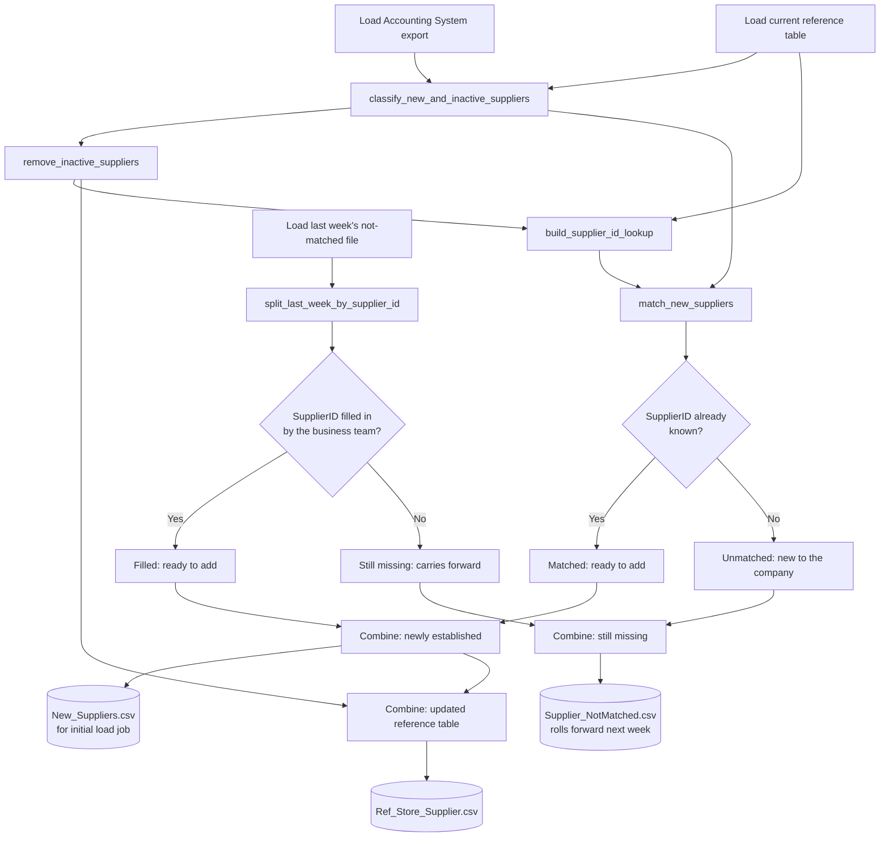
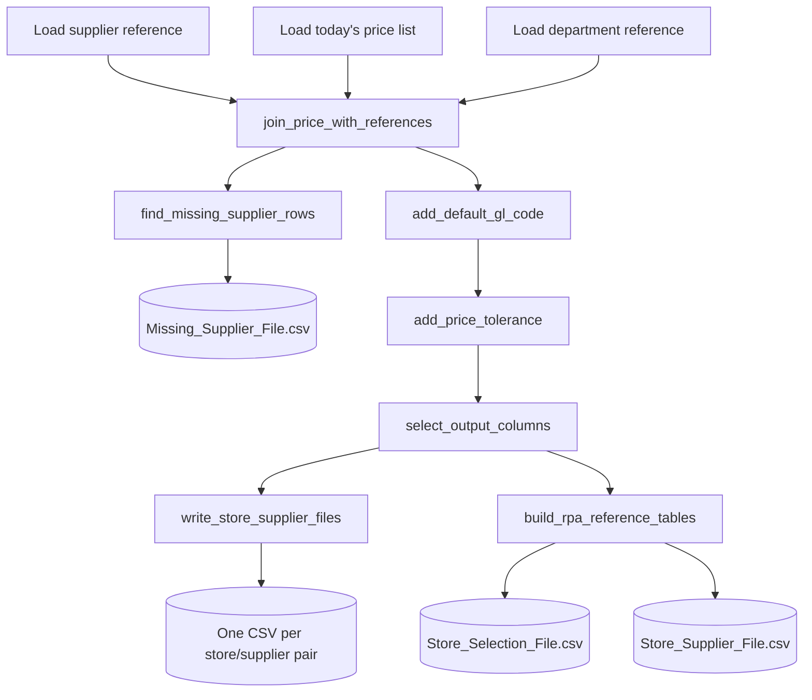
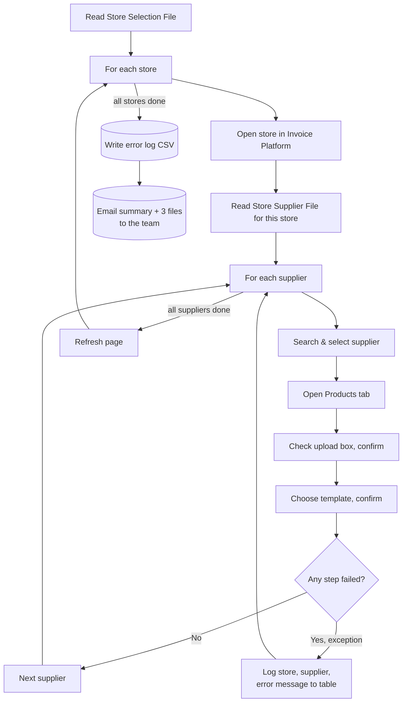

# Product Price Update Automation

> This is a de-identified portfolio version of an automation I built and
> ran for a real multi-site retail business. Employer, coworker, and
> internal system/infrastructure names have been replaced with generic
> placeholders; the code and architecture are unchanged.

Keeps store-supplier relationships and daily prices in sync between the
accounting system, the price update spreadsheet, and the RPA bot
that uploads the results into Invoice Platform.

This repo contains two parts:

```
python/   Python package + entry-point scripts (Supplier Update, Price Update)
rpa/      UiPath Studio project that uploads the files Python produces
```

## Setup

```
cd python
pip install -e ".[dev]"
cp .env.example .env   # then fill in DATA_ROOT for this machine
```

Everything below `DATA_ROOT` is hardcoded in `config.py` since the folder
structure is identical across machines — only `DATA_ROOT` itself changes
per machine.

---

## Python — Supplier Update (weekly)

Keeps the store-supplier reference table in sync with the Accounting System's vendor
list. A store-supplier relationship only enters the reference table once
it has a `SupplierID` — either because another store already buys from
that supplier, or because the business team manually assigns one for a
supplier that's new to the whole company. Either path needs an initial
load job, so both feed the New Suppliers export. Unmatched rows roll
forward to next week's list instead of disappearing.



Entry point: `python/scripts/run_supplier_reference_update.py`
Logic: `python/src/product_price_update_automation/supplier_update/supplier_reference.py`

---

## Python — Price Update (daily)

Joins the day's price file against the supplier and department reference
tables, flags rows whose supplier isn't recognised, applies GL codes and
price tolerance bands, then writes one upload CSV per store/supplier
pair plus the reference files the RPA needs.



Entry point: `python/scripts/run_price_update.py`
Logic: `python/src/product_price_update_automation/price_update/update_prices.py`

---

## RPA — Price Upload (UiPath)

Reads the two reference files Price Update produces, then for every
store and every supplier within it, uploads that day's price file into
Invoice Platform. Each supplier upload is wrapped in its own Try/Catch so one
failure doesn't stop the rest of the run — failures are logged to a
table instead and included in the summary email.



Entry point: `rpa/price-update-cross-stores/Main.xaml`
Logic: `rpa/price-update-cross-stores/UpdateProductList_TryCatch.xaml`

---

## Running (Python)

```python
from product_price_update_automation.config import SupplierUpdateSettings, PriceUpdateSettings
from product_price_update_automation.supplier_update.supplier_reference import run as run_supplier_update
from product_price_update_automation.price_update.update_prices import run as run_price_update

run_supplier_update(SupplierUpdateSettings())
run_price_update(PriceUpdateSettings())
```

Both are scheduled independently via Windows Task Scheduler (weekly and
daily respectively) — see each script's docstring for the exact command
line used. The RPA project is triggered separately once Price Update's
output files land in the shared upload folder.
